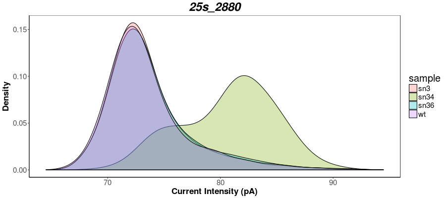

# NanoRMS: predicting NANOpore Rna Modification Stoichiometry
Prediction and visualization of RNA modification stoichiometry in direct RNA sequencing datasets from per-read information 


## Table of Contents  
- [General Description](#General-description)
- [De novo prediction of RNA modified sites](#De-novo-prediction-of-RNA-modified-sites)
- [RNA modification stoichiometry estimation using Nanopolish resquiggling (not recommended)](#RNA-modification-stoichiometry-estimation-using-nanopolish-resquiggling)
- [RNA modification stoichiometry estimation using Tombo resquiggling (recommended)](#RNA-modification-stoichiometry-estimation-using-tombo-resquiggling)
- [Visualization of per-read current intensities at individual sites](Visualization-of-per-read-current-intensities-at-individual-sites)
- [Citation](#Citation) 
- [Contact](#Contact) 
 

## General description
* NanoRMS predicts modification stoichiometries by classifying reads into modified/unmodified, based on their per-read features (current intensity, dwell time and/or trace).
* NanoRMS can be run in single mode (1sample) or paired mode (2 samples).
* NanoRMS can run both unsupervised (e.g. KMEANS, Aggregative Clustering, GMM) and supervised machine learning algorithms (e.g. KNN, Random Forest). The later will require pairwise samples where one of the conditions is a knockout.
* NanoRMS can predict stoichiometry from Nanopolish resquiggled reads or from Tombo resquiggled reads. The latter is the recommended option.

## De novo prediction of RNA modified sites

### 1. Extract base-calling features using Epinano-RMS 

#### Create a dictionary file from reference fasta
Please note that we are using  a modified version of [EpiNano](https://github.com/enovoa/EpiNano/blob/master/README.md) that was specifically developed for nanoRMS. 

Firstly, we need to create a dictionary file from the reference fasta file
```
java -jar epinano_RMS/picard.jar CreateSequenceDictionary REFERENCE=reference.fasta OUTPUT= reference.fasta.dict
```

#### Run Epinano-RMS
Requires python3

```
python3 epinano_RMS/epinano_rms.py -R <reference_file> -b <bam_file> -s epinano_RMS/sam2tsv
```
Example using test data: 

```
python3 epinano_RMS/epinano_rms.py -R test_data/yeast_rRNA_ref -b test_data/wt_sorted.bam -s epinano_RMS/sam2tsv
```

### 2. Predict RNA modifications

#### a) Single sample RNA modification prediction

Prediction of pseudouridine sites on mitochondrial ribosomal RNAs using three biological replicates:

```
Rscript predict_singleSample.R <epinanofile_rep1> <epinanofile_rep2> <epinanofile_rep3> 
```

Example using test data: 
```
Rscript predict_singleSample.R wt_epinano.csv sn3_epinano.csv sn36_epinano.csv
```
Single sample de novo RNA modification prediction has been tested for predicting pseudouridine RNA modifications in mitochondrial rRNAs, and the novel predicted sites were afterwards validated using CMC-based probing followed by sequencing), validating 2 out of the 2 sites that were predicted in all 3 biological replicates. 

Using identified pseudouridine base-calling error signatures, nanoRMS can  predict RNA modifications de novo in single samples, as long as if the stoichiometry of modification is sufficiently high (i.e. to be distinguished from background base-calling error of direct RNA sequencing).

#### b) Paired sample RNA modification prediction

OGUZHAN CODE HERE 

## RNA modification stoichiometry estimation using Nanopolish resquiggling 

This version is deprecated. If you still wish to use it, you can find the details and code [here](https://github.com/novoalab/nanoRMS/blob/master/README_nanoRMS_nanopolish.md) 


## RNA modification estimation stoichiometry using Tombo resquiggling 

TO BE COMPLETED


## Visualization of per-read current intensities at individual sites

### 1. Data pre-processing

Firstly, generate a collapsed Nanopolish event align output, by collapsing all the multiple observations for a given position from a same read.

```
python3 per_read_mean.py <event_align_file>
```

Example using test data:

```
python3 per_read_mean.py test_data/data1_eventalign_output.txt
```
Secondly, create 15-mer windows of per-read current intensities centered in positions of interest

The output of Nanopolish event align generated in the previous step is used as input in this script.

```
Rscript --vanilla nanopolish_window.R positions_file <input_table> <label>
```

Example using test data:

```
Rscript --vanilla nanopolish_window.R test_data/positions test_data/data1_eventalign_output.txt_processed_perpos_mean.csv data1
```


### 2. Visualization of current intensity information:

#### 2.1 Density plots

```
Rscript --vanilla density_nanopolish.R <window_file1> <window_file2> <window_file3(optional)> <window_file4(optional)>
```

Example using test data:

```
Rscript --vanilla nanopolish_density_plot.R test_data/sn34_window_file.tsv test_data/wt_window_file.tsv
```




#### 2.2. Mean current intensity plots centered in the modified sites
```
Rscript --vanilla nanopolish_meanlineplot.R <window_file1> <window_file2> <window_file3(optional)> <window_file4(optional)>
```
Example using test data:

```
Rscript --vanilla nanopolish_meanlineplot.R test_data/sn34_window_file.tsv test_data/wt_window_file.tsv
```


#### 2.3 Per-read current intensity plots centered in the modified sites
```
Rscript --vanilla nanopolish_perreadlineplot.R <window_file1> <window_file2> <window_file3(optional)> <window_file4(optional)>
```
Example using test data:

```
Rscript --vanilla nanopolish_perreadlineplot.R test_data/sn34_window_file.tsv test_data/wt_window_file.tsv
```


#### 2.4 PCA plots from the per-read 15-mer current intensity data
```
Rscript --vanilla nanopolish_pca.R <window_file1.tsv> <window_file2.tsv> <window_file3.tsv(optional)> <window_file4.tsv(optional)>
```

Example using test data:

```
Rscript --vanilla nanopolish_pca.R test_data/sn34_window_file.tsv test_data/wt_window_file.tsv
```


## Citation: 

Begik O*, Lucas MC*, Ramirez JM, Milenkovic I, Cruciani S, Vieira HGS, Medina R, Liu H, Sas-Chen A, Mattick JS, Schwartz S and Novoa EM. Decoding ribosomal RNA modification dynamics at single molecule resolution. bioRxiv 2020. doi: https://doi.org/10.1101/2020.07.06.189969

## Contact
Please open an issue in the GitHub repo if you have any questions/doubts/suggestions about how to use this software. Thanks!
